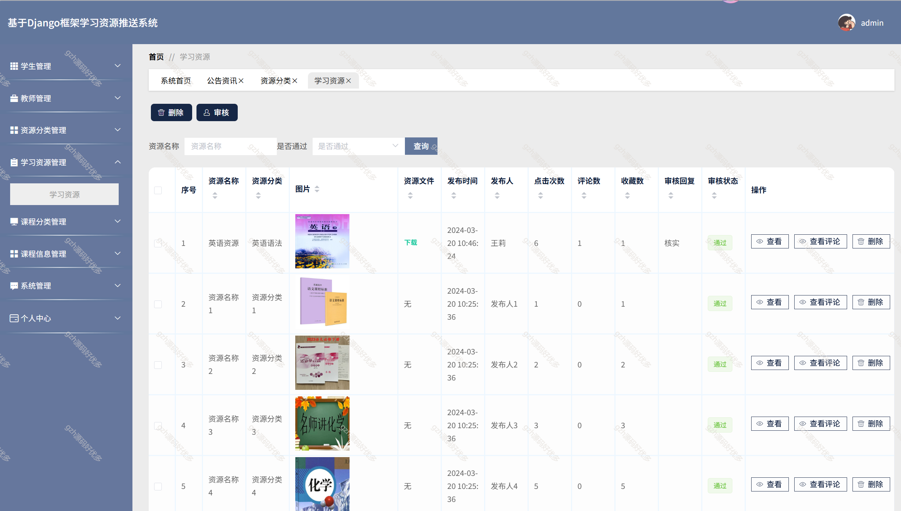

# python047
python047基于Python+Django的学习资源推荐系统
 
## 查看主页获取源码

### 一、关键词
学习资源推荐系统,学习系统推荐

### 二、作品包含
源码+数据库+全套环境和工具资源+部署教程

### 三、项目技术
前端技术：Vue2.0、Element-ui
后端技术：Python3.7、Django2.0

### 四、运行环境（以下版本亲测，其他版本未知，请自测）
开发工具：PyCharm + VSCODE

数据库：MySQL5.7（最低要5.7版本）

数据库管理工具：Navicat10+

Python：Python3.7

前端Nodejs：14

浏览器：谷歌浏览器

### 五、项目介绍
项目编号：python047

学习资源推荐系统是依据学习者个体差异（如学习目标、知识基础、学习风格等。

功能学生管理，用户管理，资源分类管理，学习资源分类，课程分类，课程信息分类。

### 六、运行截图

